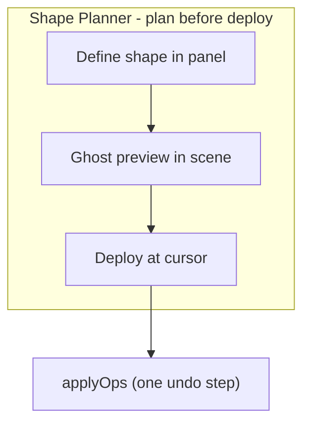
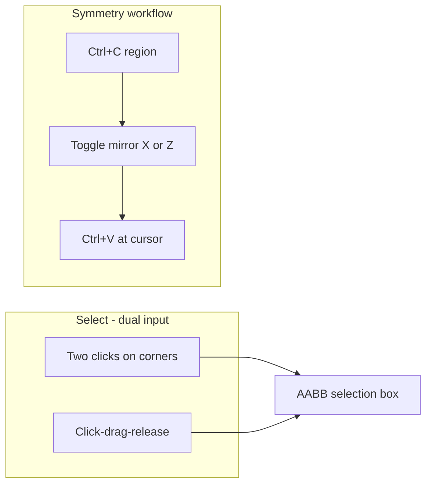

# Selection HUD, mirror tools, Shape Planner, stroke polish, and smart-connect UI

Builds on line-stroke / right-click orbit work. Implements [PROJECT_PLAN B2](/home/ewillinux/obsidian-protocol/docs/PROJECT_PLAN.md), mirror tooling (B1 overlap), a new **Shape Planner** coordinate/parametric builder, and brush UX gaps from [docs/features.md](/home/ewillinux/obsidian-protocol/docs/features.md).

---

## Drag marquee vs symmetrical shapes vs Shape Planner

| Feature | What it does |
|---------|----------------|
| **Drag marquee** | Faster AABB region pick (same box as two-click) |
| **Mirror paste/stamp** | Flip a copied/stamped shape for symmetrical builds |
| **Shape Planner** | Define geometry by **exact coordinates** or **parametric math** in a planning stage → ghost preview → **Deploy** commits to world |

The Planner is the path to shapes **beyond cube/sphere brush footprints** — polylines through typed vertices, spheres/cylinders from radius equations, later arches/ramps/polygon fills.



**Hard rule:** While a planner draft is active, panel edits update **preview only** — no `applyOps` until user clicks **Deploy** (or Enter). Esc cancels draft / closes planner mode.

---

## Current state

| Area | Today | Gap |
|------|-------|-----|
| **Select (X)** | Two clicks only in [`Interaction.tsx`](/home/ewillinux/obsidian-protocol/components/scene/Interaction.tsx) | No box/HUD; no drag marquee |
| **Mirror** | None | No flip on paste or stamp |
| **Strokes** | Line + batched freehand on release | Freehand skips cells on fast diagonals |
| **smartConnect / randomness** | Logic exists in [`lib/brush.ts`](/home/ewillinux/obsidian-protocol/lib/brush.ts) | No toolbar UI |
| **Shape Planner** | None | No coordinate input or parametric voxelization |



---

## Part 1 — Selection box + HUD + dual select UX (B2)

### 1a. Shared selection bounds — [`lib/selection.ts`](/home/ewillinux/obsidian-protocol/lib/selection.ts) (new)

```ts
export function selectionBounds(
  start: Vec3, end: Vec3 | null, hover: Vec3 | null,
): { min: Vec3; max: Vec3; size: Vec3; volume: number; center: Vec3 } | null

export function countBlocksInBounds(min: Vec3, max: Vec3): number
```

- Normalize min/max regardless of click order.
- When only `selectionStart` is set, use `hoverCell` as provisional second corner for live preview.

### 1b. Dual select interaction — [`Interaction.tsx`](/home/ewillinux/obsidian-protocol/components/scene/Interaction.tsx)

Support **both** input methods in select mode:

| Gesture | Behavior |
|---------|----------|
| **Click** (down + up on same cell) | Two-click flow: 1st click → `selectionStart`; 2nd click → `selectionEnd`; 3rd click → reset and new start |
| **Drag** (down on A, up on B ≠ A) | Marquee: set `selectionStart` = A, `selectionEnd` = B on pointer-up (reuse line-stroke pointer pattern + window `pointerup`) |

Detection: compare resolved cell at pointer-down vs pointer-up; same cell = click, different = marquee.

- Live preview during marquee drag via `setSelectionEnd` or dedicated preview state (same as line stroke preview).
- **Esc** clears selection ([`useKeyboardShortcuts.ts`](/home/ewillinux/obsidian-protocol/hooks/useKeyboardShortcuts.ts)).
- Right-click still passes through for camera orbit (no select on button 2).

### 1c. `SelectionBox.tsx` (new) — mount in [`Scene.tsx`](/home/ewillinux/obsidian-protocol/components/scene/Scene.tsx)

- Wireframe AABB box + corner tick marks at start/end.
- Visual only — no voxel mutations.

### 1d. `SelectionHud.tsx` (new) — mount in [`App.tsx`](/home/ewillinux/obsidian-protocol/components/App.tsx)

- Visible in select mode or when selection exists.
- **Dimensions** W×H×D, **volume**, **filled** block count.
- Hints: `Click corners or drag box · Ctrl+C copy · Esc clear`
- Recalc on selection/hover change + debounced engine `patch` events.

---

## Part 2 — Mirror tools (symmetrical builds)

Shared transform layer used by **clipboard paste** and **stamp placement** (covers core of PROJECT_PLAN B1 mirror/rotate; stamp **rotate R** can ship in same pass or immediately after).

### 2a. Transform helpers — [`lib/artifacts/transform.ts`](/home/ewillinux/obsidian-protocol/lib/artifacts/transform.ts) (new)

Pure functions on `ArtifactCell[]` relative to anchor:

```ts
export type MirrorAxis = 'x' | 'z';
export function mirrorCells(cells: ArtifactCell[], axis: MirrorAxis): ArtifactCell[]
export function rotateCellsY90(cells: ArtifactCell[], steps: 0|1|2|3): ArtifactCell[]  // optional B1
```

- Mirror: negate `dx` or `dz` (and adjust if combined X+Z — apply sequentially).
- Deduplicate colliding cells after transform (last wins or merge — document choice).

### 2b. UI state — [`stores/uiStore.ts`](/home/ewillinux/obsidian-protocol/stores/uiStore.ts)

```ts
pasteMirror: { x: boolean; z: boolean }
stampTransform: { mirrorX: boolean; mirrorZ: boolean; rotationY: 0|1|2|3 }
```

Persist only for session (not localStorage).

### 2c. Paste with mirror — [`Toolbar.tsx`](/home/ewillinux/obsidian-protocol/components/ui/Toolbar.tsx), [`useKeyboardShortcuts.ts`](/home/ewillinux/obsidian-protocol/hooks/useKeyboardShortcuts.ts)

- Before `applyOps` on paste, run `mirrorCells` when toggles active.
- **Toolbar clipboard group:** mirror-X / mirror-Z toggle buttons (active state visible).
- Optional: **Shift+V** = paste with mirror-X (document in shortcuts).
- Chrono label: `Paste "name" (mirror X)` when applicable.

**Symmetry workflow:** Select region → Ctrl+C → enable mirror-X → move cursor to other side of structure → Ctrl+V.

### 2d. Stamp with mirror — [`Interaction.tsx`](/home/ewillinux/obsidian-protocol/components/scene/Interaction.tsx), [`Cursor.tsx`](/home/ewillinux/obsidian-protocol/components/scene/Cursor.tsx)

- Apply `stampTransform` when placing from [`stampArtifact`](/home/ewillinux/obsidian-protocol/stores/uiStore.ts).
- Ghost preview in Cursor shows mirrored/rotated stamp footprint (visual only).
- Shortcuts (align with B1): **R** = rotate stamp 90° Y; **M** = toggle mirror-X while stamping (stamp mode only; paste uses toolbar toggles to avoid conflict — or M only when `stampArtifact` active, which [`useKeyboardShortcuts.ts`](/home/ewillinux/obsidian-protocol/hooks/useKeyboardShortcuts.ts) already prioritizes for Esc).

---

## Part 3 — Stroke batching polish

### 3a. Freehand gap fill — [`lib/brush.ts`](/home/ewillinux/obsidian-protocol/lib/brush.ts)

```ts
export function cellsBetweenCenters(from, to, brush, activeBlock?): Vec3[]
```

Union interpolated cells between consecutive freehand steps (reuse `strokeCenters` / `cellsAlongStroke` logic).

### 3b. Clearer chrono labels — [`Interaction.tsx`](/home/ewillinux/obsidian-protocol/components/scene/Interaction.tsx)

`Line stroke`, `Paint stroke`, `Line purge`, etc. by mode + stroke type.

---

## Part 4 — Smart-connect + randomness UI

Toolbar brush group ([`Toolbar.tsx`](/home/ewillinux/obsidian-protocol/components/ui/Toolbar.tsx)):

- **Smart connect** toggle → `brush.smartConnect` (Manhattan paths for power-line / circuit line strokes).
- **Randomness** slider 0–100% → `brush.randomness`.
- Highlight smart-connect when `activeBlock` is `power-line` or `circuit`.

---

## Part 5 — Shape Planner (coordinate input + parametric shapes)

Dedicated **planning stage** panel — users define geometry precisely before anything hits the vault.

### 5a. Data model — [`types/index.ts`](/home/ewillinux/obsidian-protocol/types/index.ts) + [`stores/uiStore.ts`](/home/ewillinux/obsidian-protocol/stores/uiStore.ts)

```ts
export type PlannerKind =
  | 'polyline'   // point list → connected path
  | 'polygon'    // closed point list → fill (phase B)
  | 'sphere'
  | 'cylinder'
  | 'arch'       // phase B
  | 'ramp';      // phase B

export interface ShapePlannerDraft {
  kind: PlannerKind;
  points: Vec3[];           // polyline / polygon vertices (local offsets from anchor)
  center: Vec3;             // parametric origin (local)
  radius: number;
  height: number;
  hollow: boolean;          // shell only vs solid (where applicable)
  fillMode: 'stroke' | 'solid';  // polyline: 1-voxel path vs thick brush footprint
}
```

Store fields:

- `panels.shapePlanner: boolean`
- `shapePlannerDraft: ShapePlannerDraft | null`
- `shapePlannerActive: boolean` — true while draft exists; blocks normal left-click paint in [`Interaction.tsx`](/home/ewillinux/obsidian-protocol/components/scene/Interaction.tsx) (same priority pattern as `stampArtifact`)
- Hotkey **`G`** toggles panel (Geometry planner)

### 5b. Voxelization — [`lib/shapes/planner.ts`](/home/ewillinux/obsidian-protocol/lib/shapes/planner.ts) (new)

Pure functions: `draft → Array<[x,y,z]>` in **local space** (relative to deploy anchor):

| Kind | Math / algorithm |
|------|------------------|
| **Polyline** | Chain [`voxelLine3D`](/home/ewillinux/obsidian-protocol/lib/brush.ts) between consecutive points; optional thick footprint via `brushCells` at each center |
| **Polygon** (phase B) | Closed loop → scanline fill on dominant plane (XZ at fixed Y) |
| **Sphere** | `(x-cx)²+(y-cy)²+(z-cz)² ≤ r²`; integer radius; optional hollow shell |
| **Cylinder** | `(x-cx)²+(z-cz)² ≤ r²` and `cy ≤ y < cy+height` |
| **Arch** (phase B) | Quarter-cylinder or semicircle extrusion |
| **Ramp** (phase B) | Wedge: linear height ramp across X or Z span |

Reuse existing [`voxelLine3D`](/home/ewillinux/obsidian-protocol/lib/brush.ts), [`cellsAlongStroke`](/home/ewillinux/obsidian-protocol/lib/brush.ts), world bounds filter from [`lib/constants.ts`](/home/ewillinux/obsidian-protocol/lib/constants.ts).

Export helper:

```ts
export function voxelizePlannerDraft(
  draft: ShapePlannerDraft,
  anchor: Vec3,
  brush?: Brush,
): Array<[number, number, number]>
```

### 5c. UI — [`components/ui/ShapePlannerPanel.tsx`](/home/ewillinux/obsidian-protocol/components/ui/ShapePlannerPanel.tsx) (new)

Mount in [`App.tsx`](/home/ewillinux/obsidian-protocol/components/App.tsx); open from toolbar/panel group or **`G`**.

**Tabs or dropdown:** Point list | Parametric

**Point list tab:**
- Editable table: rows of `X Y Z` number inputs
- Add / remove / reorder rows
- Import current hover cell as next point (button)
- Options: open vs closed path; stroke width (0 = 1-voxel line)

**Parametric tab:**
- Preset picker: Sphere, Cylinder (+ Arch/Ramp in phase B)
- Numeric inputs: center offset (X Y Z), radius, height
- Hollow toggle where relevant
- Live cell count readout in panel footer

**Actions (planning stage):**
- **Preview** — always live as draft edits (no separate button needed)
- **Deploy** — `getEngine().applyOps()` at `hoverCell` anchor with `activeBlock`; label `"Deploy shape"`; one undo step
- **Save to library** (phase C) — convert local cells → [`Artifact`](/home/ewillinux/obsidian-protocol/lib/artifacts.ts) blueprint via existing `saveArtifact`
- **Clear draft** / Esc

While planner active, show banner: *"PLAN MODE — Deploy to commit · Esc cancel"*

### 5d. Scene preview — [`components/scene/ShapePlannerPreview.tsx`](/home/ewillinux/obsidian-protocol/components/scene/ShapePlannerPreview.tsx) (new)

- Mount in [`Scene.tsx`](/home/ewillinux/obsidian-protocol/components/scene/Scene.tsx)
- Reads `shapePlannerDraft` + `hoverCell` as deploy anchor
- Renders ghost voxels (reuse Cursor ghost materials pattern); wireframe vertex markers for point-list mode
- Cap visible cells at 64 sampled for perf (show count in panel if truncated)
- **No worker mutation**

### 5e. Interaction guard — [`Interaction.tsx`](/home/ewillinux/obsidian-protocol/components/scene/Interaction.tsx)

When `shapePlannerActive`:
- Left-click **Deploy** (same as stamp click) OR defer Deploy to panel button only — **recommend panel Deploy + Enter key** to avoid accidental placement; click scene only updates hover anchor for preview offset
- Right-click orbit unchanged

### 5f. Phased delivery

| Phase | Ships |
|-------|--------|
| **5-core** | Panel shell, polyline point list, sphere, cylinder, preview, Deploy |
| **5-params** | Polygon fill, arch, ramp |
| **5-library** | Save planned shape to Artifact Library |
| **Later wave** | Math expression input (`y = f(x,z)`), CSG union/subtract |

---

## Implementation order

1. **Part 1** — selection box + dual select + HUD
2. **Part 2** — mirror tools
3. **Part 3 + 4** — stroke polish + smart-connect/randomness (parallel)
4. **Part 5-core** — Shape Planner (after mirror transform lib exists — Deploy can reuse transform for mirror symmetric parametric shapes)
5. **Part 5-params / 5-library** — follow-on in same wave if time permits

Parts 1–2 touch `Interaction.tsx` first; Part 5 adds planner guard in same file — sequence accordingly.

---

## Files to touch

| File | Change |
|------|--------|
| [`lib/selection.ts`](/home/ewillinux/obsidian-protocol/lib/selection.ts) | **New** — bounds + block count |
| [`lib/artifacts/transform.ts`](/home/ewillinux/obsidian-protocol/lib/artifacts/transform.ts) | **New** — mirror / rotate cell offsets |
| [`components/scene/SelectionBox.tsx`](/home/ewillinux/obsidian-protocol/components/scene/SelectionBox.tsx) | **New** |
| [`components/ui/SelectionHud.tsx`](/home/ewillinux/obsidian-protocol/components/ui/SelectionHud.tsx) | **New** |
| [`components/scene/Scene.tsx`](/home/ewillinux/obsidian-protocol/components/scene/Scene.tsx) | Mount `SelectionBox` |
| [`components/App.tsx`](/home/ewillinux/obsidian-protocol/components/App.tsx) | Mount `SelectionHud` |
| [`components/scene/Interaction.tsx`](/home/ewillinux/obsidian-protocol/components/scene/Interaction.tsx) | Dual select; stamp transform; freehand gap fill |
| [`components/scene/Cursor.tsx`](/home/ewillinux/obsidian-protocol/components/scene/Cursor.tsx) | Stamp ghost with mirror/rotate |
| [`lib/brush.ts`](/home/ewillinux/obsidian-protocol/lib/brush.ts) | `cellsBetweenCenters` |
| [`stores/uiStore.ts`](/home/ewillinux/obsidian-protocol/stores/uiStore.ts) | `pasteMirror`, `stampTransform` |
| [`components/ui/Toolbar.tsx`](/home/ewillinux/obsidian-protocol/components/ui/Toolbar.tsx) | Mirror toggles, smartConnect, randomness |
| [`hooks/useKeyboardShortcuts.ts`](/home/ewillinux/obsidian-protocol/hooks/useKeyboardShortcuts.ts) | Esc, R/M stamp, G planner, optional Shift+V |
| [`lib/shapes/planner.ts`](/home/ewillinux/obsidian-protocol/lib/shapes/planner.ts) | **New** — parametric + point-list voxelization |
| [`components/ui/ShapePlannerPanel.tsx`](/home/ewillinux/obsidian-protocol/components/ui/ShapePlannerPanel.tsx) | **New** — coordinate/parametric UI |
| [`components/scene/ShapePlannerPreview.tsx`](/home/ewillinux/obsidian-protocol/components/scene/ShapePlannerPreview.tsx) | **New** — ghost preview |
| [`types/index.ts`](/home/ewillinux/obsidian-protocol/types/index.ts) | `PlannerKind`, `ShapePlannerDraft` |
| Docs | `features.md`, `how-to-extend.md`, `ShortcutsOverlay.tsx` |

**Out of scope (this wave):** math expression parser, CSG boolean ops, center-anchored symmetric marquee, radial symmetry, box fill tool, engine/worker changes.

---

## Test plan

1. **Two-click select:** corners set box + HUD; third click starts fresh; Esc clears.
2. **Drag marquee:** drag diagonal box; same HUD/box as two-click.
3. **Mirror paste:** copy asymmetric chunk → mirror-X → paste → mirrored duplicate; undo once reverts.
4. **Stamp mirror:** stamp mode → M toggles mirror → ghost updates → click places flipped prefab.
5. **Freehand gap fill:** fast diagonal leaves no holes; one undo.
6. **Smart-connect + randomness:** orthogonal power-line paths; randomness skips cells.
7. **Shape Planner:** add 3 points → polyline preview → Deploy at cursor → one undo; sphere/cylinder from radius inputs.
8. **Planner guard:** no accidental paint while plan draft active; Esc clears draft.
9. **Regression:** right-click orbit, line stroke, Shift axis-lock, Ctrl+C/V unchanged.
