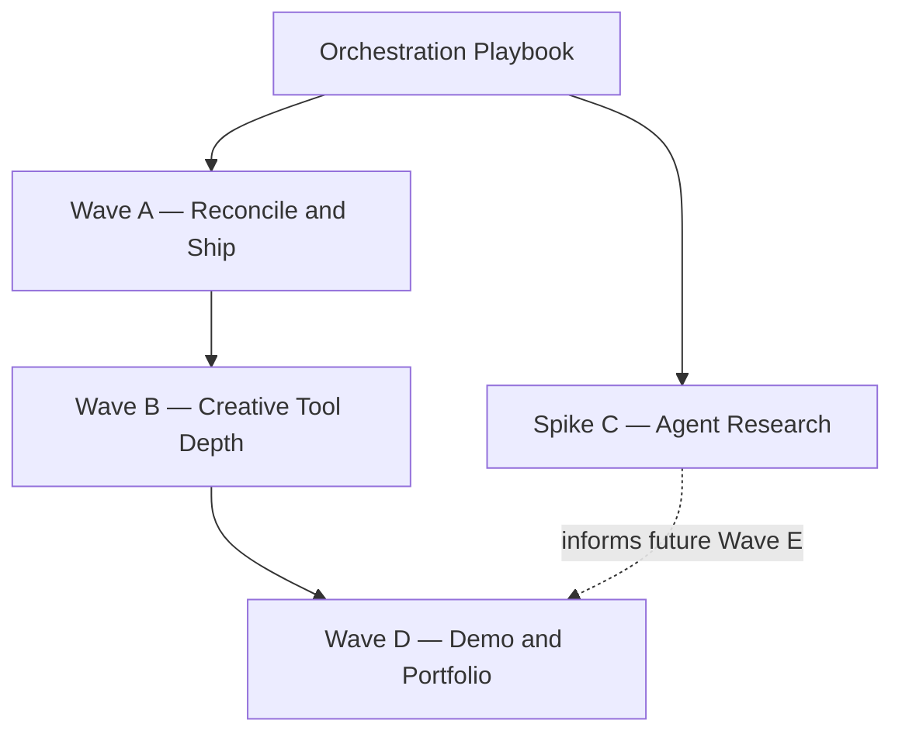

# Obsidian Protocol — Master Plan v2 (Agent-Orchestrated)

**Saved:** 2026-05-22  
**Purpose:** Wave-based execution plan for agents and humans. Each ticket is self-contained with file touch-lists, hard constraints, and verification gates.

**North star:** Creative tool depth first — Studio mode (immersive HUD optional) and Artifact Library as the product differentiator. V2 engine work is supporting infrastructure (**complete**). In-product AI agents are **research only** (Spike C); no agent code until a future Wave E.

**Constraint source of truth:** [docs/how-to-extend.md](how-to-extend.md) — read before every ticket.

**Current snapshot (2026-06-08):** `master` — V2 Phases 0–5, Wave A, most of Wave B, partial Wave D, HUD reskin, CI, Vitest (19 tests), Playwright smoke E2E, corner-locked polyline brush, and **Spike C memo written** ([docs/agents-research.md](agents-research.md)). **Not done:** B5 greedy meshing (descoped), C1→Wave E agent *code*, production Vercel URL in docs.

---

## Orchestration playbook

Use this shape for **every** ticket below. Fields are bullet lists inside each `###` ticket heading.

### Uniform ticket fields

- **Scope** — One paragraph; budget ≤3 hours of focused agent work.
- **File touch-list** — Exact paths the agent may edit. Do not expand scope to other files without a new ticket.
- **Hard constraints** — Non-negotiable rules from [how-to-extend.md § Hard constraints](how-to-extend.md#hard-constraints-do-not-violate). Ticket blocks repeat the subset that applies; full list:
  1. Never recreate `stores/voxelStore.ts` — canonical voxel state lives in `engine/worker/voxel.worker.ts`.
  2. React/UI must not import from `engine/` — use `hooks/useEngine.ts` and `types/engine.ts`.
  3. All voxel mutations via `IVoxelEngine` (`applyOps`, `undo`, `redo`, `clearAll`, `loadSave`, layer ops).
  4. `BLOCK_INDEX_TABLE` is append-only — no reordering or inserting indices.
  5. No full-rebuild render paths — GPU updates: worker `PATCH` → `RenderBridge.queueDeltas()` → `flushPending()` in `Voxels.tsx` `useFrame`.
  6. Pointer picking stays on R3F in `Interaction.tsx` unless explicitly tasked to migrate to `engine.raycast()`.
  7. Performance: particles ≤360; avoid `getAllCells()` except save/load; one shared `uTime` for shader blocks.
  8. Next.js 14 only — no Next 15 / R3F v9 upgrade without dedicated migration ticket.
- **Verification gate** — `npm run typecheck` + `npm run build` + named manual smoke (browser).
- **Parallelizable?** — `yes` / `no` — Wave A is sequential; Wave B may use parallel worktrees.
- **Suggested agent** — `generalPurpose` | `best-of-n-runner` | `cursor-guide`
- **Prompt template** — Copy-paste starter for the agent.

**Standard prompt template:**

```
Implement ticket {ID} from docs/PROJECT_PLAN.md. Read docs/how-to-extend.md first.
Constraints listed in the ticket are hard. Do not touch files outside the touch-list.
Run verification gate before marking done.
```

### Human-in-the-loop state machine

Each ticket moves through explicit states. Humans review before merge.

```
                    ┌─────────────┐
                    │   Queued    │
                    └──────┬──────┘
                           │ agent/human picks ticket
                           ▼
                    ┌─────────────┐
         ┌─────────│ InProgress  │─────────┐
         │         └──────┬──────┘         │
         │                │ PR/commit      │
         │                ▼ ready           │ abandon
         │         ┌─────────────┐         │
         │         │ Awaiting    │         │
         │         │   Review    │         │
         │         └──────┬──────┘         │
         │    approve     │     request    │
         │                │   changes      │
         │                ▼                │
         │         ┌─────────────┐       │
         └────────►│  Revisions  │◄──────┘
                   └──────┬──────┘
                          │ approved
                          ▼
                   ┌─────────────┐
                   │   Merged    │
                   └─────────────┘
```

- **Queued** — Ticket defined; no active work.
- **InProgress** — Agent or human implementing; branch or local commits allowed.
- **AwaitingReview** — Verification gate passed; human reviews diff + smoke notes.
- **Revisions** — Feedback loop; return to InProgress.
- **Merged** — Landed on `master` (Wave A: typically one commit per ticket).

---

## Current reality check

**Branch:** `master` @ `3f95ec0` — pushed to `origin/master` (May 2026).

| Area | Key files / symbols | Status |
|------|---------------------|--------|
| V2 Phases 0–5 | `engine/`, `hooks/useEngine.ts`, `lib/persistence.ts` | ✅ Committed |
| Wave A — OBS2 I/O, Studio/Immersive, toolbar groups, Artifact Library | `lib/persistence.ts`, `ArtifactLibraryPanel.tsx`, `uiStore.immersiveMode` | ✅ A1–A4 |
| Wave A — CI | `.github/workflows/ci.yml` | ✅ A6 |
| Wave B — stamp rotate/mirror + ghost | `lib/artifacts/transform.ts`, `Cursor.tsx`, `useKeyboardShortcuts.ts` | ✅ B1 |
| Wave B — selection box + HUD | `SelectionBox.tsx`, `SelectionHud.tsx` | ✅ B2 |
| Wave B — prefab pack (18 shipped) | `lib/artifacts/prefabs.ts`, `scripts/extract-prefabs.mjs` | ✅ B3 |
| Wave B — glTF export | `lib/exporters/gltf.ts`, Toolbar IO group | ✅ B4 |
| Wave B — greedy meshing spike | — | ⏸ Descoped (B5 not implemented) |
| Wave B — Vitest + Playwright | 8 test files (19 Vitest), `e2e/smoke.spec.ts` | ✅ B6 |
| Wave D — partial polish | `FirstRunHints.tsx`, `CanvasHud.tsx`, `StatusBar.tsx`, HUD reskin (`globals.css`) | ✅ Partial D1/D3 |
| Wave D — Vercel deploy URL | `vercel.json`, `docs/deploy.md` | ⏳ D2 — config ready; no pinned prod URL in repo |
| Spike C — agent research memo | `docs/agents-research.md` | ✅ C1 written (2026-06-08) — NL→voxel agent spec, grounded against engine |
| Brush depth — line stroke, smart connect | `lib/brush.ts`, `Interaction.tsx`, `types/index.ts` | ✅ Shipped with Wave B commit |
| Settings presets + persistence | `lib/settingsPresets.ts`, `lib/settingsPersistence.ts` | ✅ Shipped with reskin |

### Known gaps (honest; not blockers for planning)

| Gap | Notes | Ticket |
|-----|-------|--------|
| `AUTOSAVE_KEY_V2` / `SAVE_DB_KEY_V2` | Deprecated aliases in `lib/constants.ts` — persistence uses v1 idb keys with OBS2 payloads | Documented in constants |
| `ContractPanel` not immersive-gated | Only Toolbar contract button respects `immersiveMode` | A2 optional follow-up |
| Greedy meshing | No `uiStore.quality.greedyMesh` flag — B5 descoped after Wave B landing | Future spike |
| Raycast worker unused for input | `Interaction.tsx` uses R3F — by design until profiled | Out of scope |
| Agent integration | Research memo done (`docs/agents-research.md`); no code until Wave E | C1 ✅ → Wave E |
| Production deploy URL | Vercel config present; preview/prod URL not checked into docs | D2 |

---

## Wave overview



| Wave | Goal | Parallel? | Status |
|------|------|-----------|--------|
| **A** | Clean tree, push to origin, docs match code | No — sequential A1→A6 | ✅ Complete (`3f95ec0`) |
| **B** | Artifact Library + Studio depth | Yes — B1–B6 in worktrees | ✅ B1–B4, B6 done; B5 descoped |
| **C** | AI agent research memo only | No code | ✅ C1 written → Wave E |
| **D** | Demo / deploy / polish | After B | 🔶 Partial — HUD/onboarding polish landed; D2 URL TBD |

---

## Wave A — Reconcile and ship ✅

**Goal:** Working tree reconciled into reviewable commits, documentation accurate, branch pushed to `origin/master`.

**Status:** Landed in commit `3f95ec0` (single consolidated commit with Wave B + reskin).

**Rules:** Run **A1 → A6 in order**. One ticket = one commit. Do not parallelize — overlapping file conflicts (especially `uiStore`, `Toolbar`, `Interaction`).

---

### A1 — Phase 5 OBS2 user-facing I/O

- **Scope:** Land Phase 5 for users: commit staged engine serialization changes with unstaged `lib/persistence.ts`, fix Toolbar tooltips to "Export vault" / "Import vault", verify autosave and named save round-trip (OBS2 binary; JSON fallback on load). Document or intentionally leave `AUTOSAVE_KEY_V2` / `SAVE_DB_KEY_V2` as-is if keys unchanged.
- **File touch-list:**
  - `lib/persistence.ts`
  - `components/ui/Toolbar.tsx`
  - `engine/worker/voxel.worker.ts` (staged)
  - `engine/bridge/WorkerProtocol.ts` (staged)
  - `engine/core/VoxelEngine.ts` (staged)
  - `types/engine.ts` (staged)
  - `lib/constants.ts` (only if wiring V2 keys — optional)
- **Hard constraints:**
  - Mutations and saves via `IVoxelEngine` / `lib/persistence.ts` — no direct chunk writes.
  - No `engine/` imports in `Toolbar.tsx`.
  - `BLOCK_INDEX_TABLE` unchanged.
  - Save/load must not trigger full GPU rebuild from a cells Map.
- **Verification gate:**
  - `npm run typecheck`
  - `npm run build`
  - Manual: Load **Blackspire Arcology** → named save → reload page → vault intact.
  - Manual: Export vault file → import → round-trip.
  - Manual: Autosave survives refresh.
- **Parallelizable?** no
- **Suggested agent:** generalPurpose
- **Prompt template:**
  ```
  Implement ticket A1 from docs/PROJECT_PLAN.md. Read docs/how-to-extend.md first.
  Commit staged engine Phase 5 bits with lib/persistence.ts and Toolbar tooltip fixes.
  Constraints listed in the ticket are hard.
  ```

---

### A2 — Studio vs Immersive Mode split

- **Scope:** Finalize `immersiveMode` UX: integrity meter, anomaly alert, and contract Toolbar entry visible only when immersive is on; Settings panel exposes toggle with clear Studio vs Immersive labeling. Optional: gate `ContractPanel` the same way (currently only Toolbar button is gated — note in commit message if deferred).
- **File touch-list:**
  - `stores/uiStore.ts` (`immersiveMode` only — no voxel fields)
  - `components/ui/AnomalyAlert.tsx`
  - `components/ui/IntegrityMeter.tsx`
  - `components/ui/SettingsPanel.tsx`
  - `components/ui/Toolbar.tsx`
  - `components/ui/ContractPanel.tsx` (optional immersive gate)
- **Hard constraints:**
  - Do not change `engine/worker` — integrity math runs regardless; UI gating only.
  - No `voxelStore`; no `engine/` imports in UI files.
  - Immersive flag lives in `uiStore` only.
- **Verification gate:**
  - `npm run typecheck`
  - `npm run build`
  - Manual: Settings → toggle Immersive off → integrity meter, anomaly toast, contract toolbar button hidden.
  - Manual: Toggle on → all three appear; editing still works in Studio mode.
- **Parallelizable?** no
- **Suggested agent:** generalPurpose
- **Prompt template:**
  ```
  Implement ticket A2 from docs/PROJECT_PLAN.md. Read docs/how-to-extend.md first.
  Studio mode = immersive off; game HUD elements gated on immersiveMode.
  ```

---

### A3 — Toolbar groups + LayerPanel swatches

- **Scope:** Ship collapsible toolbar groups (`toolbarGroups`, `toggleToolbarGroup`) and per-layer dominant block color swatches via `useLayerDominantBlocks()` in LayerPanel rows.
- **File touch-list:**
  - `stores/uiStore.ts` (`toolbarGroups`, `toggleToolbarGroup`)
  - `components/ui/Toolbar.tsx`
  - `hooks/useEngine.ts` (`useLayerDominantBlocks`)
  - `components/ui/LayerPanel.tsx`
- **Hard constraints:**
  - Swatches read engine state via hooks — no `getAllCells()` per frame.
  - No full-rebuild render paths introduced.
  - `uiStore` holds UI state only.
- **Verification gate:**
  - `npm run typecheck`
  - `npm run build`
  - Manual: Collapse/expand each toolbar group; state persists during session.
  - Manual: Layer panel rows show plausible dominant block colors after editing a layer.
- **Parallelizable?** no
- **Suggested agent:** generalPurpose
- **Prompt template:**
  ```
  Implement ticket A3 from docs/PROJECT_PLAN.md. Read docs/how-to-extend.md first.
  Toolbar groups + LayerPanel dominant block swatches only.
  ```

---

### A4 — Artifact Library MVP

- **Scope:** Land Artifact Library: prefab data, panel UI, region select + Ctrl+C/V copy/paste, stamp-from-library. All voxel mutations through `getEngine().applyOps()`. Include `extract-prefabs.mjs` and wire panel in `App.tsx`.
- **File touch-list:**
  - `lib/artifacts.ts`
  - `lib/artifacts/prefabs.ts`
  - `components/ui/ArtifactLibraryPanel.tsx`
  - `components/scene/Interaction.tsx`
  - `hooks/useKeyboardShortcuts.ts`
  - `stores/uiStore.ts` (`selectionStart`, `selectionEnd`, `clipboard`, `stampArtifact`, panel flag)
  - `scripts/extract-prefabs.mjs`
  - `components/App.tsx`
  - `types/index.ts` (if selection types needed)
- **Hard constraints:**
  - **All mutations via `getEngine().applyOps()`** — never write chunk data from components.
  - No `engine/` imports in `Interaction.tsx` / panels — use `getEngine()` from `useEngine.ts`.
  - Pointer picking stays R3F-based for selection.
  - Particles cap 360 if edit feedback fires on stamp.
  - `BLOCK_INDEX_TABLE` append-only if new block types in prefabs (use existing 12 blocks only for MVP).
- **Verification gate:**
  - `npm run typecheck`
  - `npm run build`
  - Manual: Drag-select region → Ctrl+C → Ctrl+V → pasted cells match source.
  - Manual: Open Artifact Library → stamp a prefab → cells appear; undo reverts.
  - Manual: Chrono-log shows descriptive labels for artifact ops.
- **Parallelizable?** no
- **Suggested agent:** generalPurpose
- **Prompt template:**
  ```
  Implement ticket A4 from docs/PROJECT_PLAN.md. Read docs/how-to-extend.md first.
  Artifact Library MVP — all voxel changes via getEngine().applyOps().
  ```

---

### A5 — Docs sync

- **Scope:** Align documentation with shipped code: Studio mode, Immersive toggle, Artifact Library, OBS2 persistence, 6 brush modes, RenderBridge paths. Fix stale `shaders.md`, `voxel-engine.md`, root `README.md`. Ensure `wiki.md` is the doc index.
- **File touch-list:**
  - `docs/wiki.md`
  - `docs/features.md`
  - `docs/how-to-extend.md`
  - `docs/technical-architecture.md`
  - `README.md`
  - `docs/shaders.md`
  - `docs/voxel-engine.md`
  - `docs/PROJECT_PLAN.md` (ticket status footnotes only if needed)
- **Hard constraints:**
  - Docs must not instruct recreating `voxelStore` or importing `engine/` from components.
  - Describe OBS2 as primary save format with JSON fallback on load.
  - No scope creep into Liveblocks/WebXR/WebGPU in feature docs unless marked roadmap.
- **Verification gate:**
  - `npm run typecheck` (no code change expected)
  - `npm run build`
  - Manual: Spot-check `how-to-extend.md` hard constraints match code.
  - Manual: `wiki.md` links resolve; no references to deleted `docs/README (1).md`.
- **Parallelizable?** no
- **Suggested agent:** generalPurpose
- **Prompt template:**
  ```
  Implement ticket A5 from docs/PROJECT_PLAN.md. Read docs/how-to-extend.md and the codebase first.
  Sync all listed docs to match Wave A features. Doc-only ticket.
  ```

---

### A6 — Push to origin (+ optional CI)

- **Scope:** Push 9+ commits to `origin/master`. Optional follow-up: GitHub Actions workflow for `typecheck` + `build` on push (separate commit or same if trivial).
- **File touch-list:**
  - `.github/workflows/ci.yml` (optional — only if adding CI)
  - Git operations only otherwise
- **Hard constraints:**
  - No force-push to `master`.
  - Do not change application code unless adding CI workflow.
- **Verification gate:**
  - `git push origin master` succeeds
  - `git status` clean on `master`
  - If CI added: workflow runs green on push
- **Parallelizable?** no
- **Suggested agent:** cursor-guide (git/CI) or human
- **Prompt template:**
  ```
  Implement ticket A6 from docs/PROJECT_PLAN.md.
  Push master to origin. Add optional CI workflow for typecheck+build if requested.
  ```

---

## Wave B — Creative tool depth ✅ (except B5)

**Goal:** Make Studio mode and Artifact Library genuinely useful for creative workflows.

**Status:** B1–B4 and B6 shipped in `3f95ec0`. **B5 greedy meshing** was not implemented — instanced rendering remains canonical.

**Rules:** Tickets **B1–B6** may run in **parallel worktrees** (`best-of-n-runner`). Merge in order **B1 → B6** to reduce conflict risk. Each ticket = one commit.

---

### B1 — Stamp polish (rotate, mirror, ghost preview)

- **Scope:** Improve stamp UX: **R** rotate stamp 90°, **M** mirror, ghost preview mesh while stamp mode active. Wire shortcuts and cursor feedback.
- **File touch-list:**
  - `components/scene/Interaction.tsx`
  - `components/scene/Cursor.tsx`
  - `stores/uiStore.ts` (stamp rotation/mirror state)
  - `hooks/useKeyboardShortcuts.ts`
  - `components/ui/ShortcutsOverlay.tsx` (binding labels)
- **Hard constraints:**
  - Stamp placement still via `getEngine().applyOps()`.
  - Ghost preview must not mutate worker state.
  - R3F picking only; no `engine.raycast()` for pointer.
  - No full-rebuild instancing.
- **Verification gate:**
  - `npm run typecheck`
  - `npm run build`
  - Manual: Enter stamp mode → ghost follows cursor → R/M change orientation → click places → undo works.
- **Parallelizable?** yes
- **Suggested agent:** best-of-n-runner
- **Prompt template:**
  ```
  Implement ticket B1 from docs/PROJECT_PLAN.md. Read docs/how-to-extend.md first.
  Stamp rotate R, mirror M, ghost preview. No worker mutation from preview.
  ```

---

### B2 — Selection box overlay + HUD

- **Scope:** Visible 3D selection box for `selectionStart`/`selectionEnd` and compact HUD (dimensions, block count).
- **File touch-list:**
  - `components/scene/SelectionBox.tsx` (new)
  - `components/scene/Scene.tsx`
  - `components/ui/SelectionHud.tsx` (new)
  - `components/App.tsx` (HUD mount)
  - `stores/uiStore.ts` (read selection only)
- **Hard constraints:**
  - Selection box is visual only — no voxel mutations.
  - No `engine/` imports in scene components except via hooks if needed for counts.
  - Use `useEngine` / layer stats hooks — avoid `getAllCells()` per frame.
- **Verification gate:**
  - `npm run typecheck`
  - `npm run build`
  - Manual: Drag-select → box aligns to voxel bounds → HUD updates live.
- **Parallelizable?** yes
- **Suggested agent:** best-of-n-runner
- **Prompt template:**
  ```
  Implement ticket B2 from docs/PROJECT_PLAN.md. Read docs/how-to-extend.md first.
  SelectionBox.tsx + SelectionHud.tsx — visual feedback only.
  ```

---

### B3 — Prefab pack v1

- **Scope:** Expand `lib/artifacts/prefabs.ts` to 8–12 named prefabs with thumbnails/metadata; update `scripts/extract-prefabs.mjs` if needed. Data + script only — minimal UI change unless listing requires it.
- **File touch-list:**
  - `lib/artifacts/prefabs.ts`
  - `lib/artifacts.ts` (registry helpers only)
  - `scripts/extract-prefabs.mjs`
  - `components/ui/ArtifactLibraryPanel.tsx` (display only if needed)
- **Hard constraints:**
  - Prefabs use existing `BlockId` values only — append-only `BLOCK_INDEX_TABLE`.
  - No new worker messages.
- **Verification gate:**
  - `npm run typecheck`
  - `npm run build`
  - Manual: Each prefab stamps correctly; no missing block indices.
  - Run `node scripts/extract-prefabs.mjs` if script changed — document in commit.
- **Parallelizable?** yes
- **Suggested agent:** best-of-n-runner
- **Prompt template:**
  ```
  Implement ticket B3 from docs/PROJECT_PLAN.md. Read docs/how-to-extend.md first.
  8–12 named prefabs in prefabs.ts; extract script if needed.
  ```

---

### B4 — glTF export

- **Scope:** Export current vault as `.gltf` / `.glb` from Toolbar IO group. New exporter module; trigger from UI only.
- **File touch-list:**
  - `lib/exporters/gltf.ts` (new)
  - `components/ui/Toolbar.tsx` (IO group button)
  - `hooks/useEngine.ts` (read-only snapshot for mesh — prefer existing serialize or bounded cell read)
- **Hard constraints:**
  - Export is read-only — no `applyOps` during export.
  - Avoid `getAllCells()` on huge vaults if possible — use engine API designed for bulk read; document if unavoidable for export.
  - No `engine/` imports in Toolbar — call exporter from hook/helper on main thread.
  - Next.js 14 only.
- **Verification gate:**
  - `npm run typecheck`
  - `npm run build`
  - Manual: Load Blackspire → Export glTF → import in external viewer (e.g. https://gltf-viewer.donmccurdy.com/) — mesh recognizable.
- **Parallelizable?** yes
- **Suggested agent:** best-of-n-runner
- **Prompt template:**
  ```
  Implement ticket B4 from docs/PROJECT_PLAN.md. Read docs/how-to-extend.md first.
  lib/exporters/gltf.ts + Toolbar export. Read-only export path.
  ```

---

### B5 — Greedy meshing spike

- **Scope:** Experimental greedy meshing behind `uiStore.quality.greedyMesh` flag (default off). Prototype in `RenderBridge` — high risk; spike may be reverted if regresses perf.
- **File touch-list:**
  - `engine/bridge/RenderBridge.ts`
  - `stores/uiStore.ts` (`quality.greedyMesh`)
  - `components/scene/Voxels.tsx` (minimal — prefer RenderBridge only)
  - `components/ui/SettingsPanel.tsx` (dev toggle, optional)
- **Hard constraints:**
  - Flag **off** by default — existing instancing path remains default.
  - No `useEffect` full instance rebuild from cells Map.
  - Worker PATCH → delta path must still work when flag off.
  - Do not change `BLOCK_INDEX_TABLE` or OBS2 format.
- **Verification gate:**
  - `npm run typecheck`
  - `npm run build`
  - Manual: Flag off → identical behavior to pre-spike.
  - Manual: Flag on → Blackspire paint/undo — document FPS/hitch outcome in PR notes.
- **Parallelizable?** yes (high-risk — isolate worktree)
- **Suggested agent:** best-of-n-runner
- **Prompt template:**
  ```
  Implement ticket B5 from docs/PROJECT_PLAN.md. Read docs/how-to-extend.md first.
  Greedy meshing spike behind uiStore.quality.greedyMesh default false.
  ```

---

### B6 — Smoke tests (Vitest)

- **Scope:** Add minimal Vitest coverage: worker protocol round-trip (INIT → APPLY_OPS → PATCH → UNDO) and OBS2 encode/decode assertions. No browser E2E in this ticket.
- **File touch-list:**
  - `package.json` / `vitest.config.ts` (new, if needed)
  - `engine/bridge/WorkerProtocol.test.ts` (new)
  - `engine/persist/obs2.test.ts` (new)
  - Test helpers under `engine/` or `lib/` as needed
- **Hard constraints:**
  - Tests must not import React or Zustand.
  - Do not change production worker semantics except bugfixes found by tests.
  - Keep tests fast (<30s total).
- **Verification gate:**
  - `npm run typecheck`
  - `npm run build`
  - `npm test` (or documented `npm run test`) — all green
- **Parallelizable?** yes
- **Suggested agent:** best-of-n-runner
- **Prompt template:**
  ```
  Implement ticket B6 from docs/PROJECT_PLAN.md. Read docs/how-to-extend.md first.
  Vitest smoke tests for WorkerProtocol and OBS2. No React tests in this ticket.
  ```

---

## Spike C — In-product AI agents (research only)

**No application code.** Deliverable is a memo only. May run in parallel with Wave B planning but must not touch `components/` or `engine/` production paths.

---

### C1 — Agent integration research memo

- **Scope:** Write `docs/agents-research.md` (~2 pages): inventory what `IVoxelEngine`, `engine.raycast()`, and `OCCUPANCY_DELTA` enable; define 3 agent archetypes; compare rendering options; list integration risks; recommend MVP scope for a future **Wave E**.
- **File touch-list:**
  - `docs/agents-research.md` (new only)
- **Hard constraints:**
  - **No code changes** — documentation only.
  - Memo must respect hard constraints from how-to-extend.md (agents would use `applyOps`, not direct chunks).
  - Do not promise Liveblocks/WebXR/WebGPU in MVP.
- **Verification gate:**
  - Human review: memo covers all sections below.
  - No `npm` required (doc-only).
- **Parallelizable?** yes (with B, but no code conflicts)
- **Suggested agent:** generalPurpose
- **Prompt template:**
  ```
  Implement ticket C1 from docs/PROJECT_PLAN.md. Read docs/how-to-extend.md and types/engine.ts first.
  Write docs/agents-research.md only — no code. See ticket sections list in PROJECT_PLAN.
  ```

**Required memo sections:**

1. **Inventory** — What `IVoxelEngine` exposes; `engine.raycast()` capabilities; `OCCUPANCY_DELTA` stream from worker; chrono-log / undo semantics agents must respect.
2. **Three archetypes** — Architect Bot (construct from plan), Anomaly Hunter (find unstable cells), Repair Drone (fix contract violations).
3. **Rendering options** — ECS sprites (README roadmap) vs `InstancedMesh` on layer 13; perf tradeoffs.
4. **Integration risks** — Main-thread budget, undo/redo labeling, contract system interaction, user vs agent edit conflicts.
5. **Recommended Wave E MVP** — Smallest shippable agent feature (e.g. single-turn "suggest placement" without autonomy).

---

## Wave D — Demo + portfolio polish 🔶

**Wave B prerequisite met** (B5 explicitly descoped). Partial polish landed in `3f95ec0`; D2 production URL still open.

---

### D1 — Cinematic onboarding revival

- **Scope:** Revive boot/onboarding flow for portfolio demos (paused per wiki — align with current `App.tsx` boot sequence). Polish timing, skip affordance, first-run hints for Studio mode + Artifact Library.
- **File touch-list:**
  - `components/App.tsx`
  - `components/ui/` boot-related panels (as identified in codebase)
  - `stores/uiStore.ts` (first-run flags only)
  - `docs/wiki.md` (onboarding status line)
- **Hard constraints:**
  - No voxel engine changes.
  - Boot must not block worker INIT.
- **Verification gate:**
  - `npm run typecheck`
  - `npm run build`
  - Manual: Fresh load → onboarding plays → skip works → editor usable.
- **Parallelizable?** no (sequential after B)
- **Suggested agent:** generalPurpose
- **Prompt template:**
  ```
  Implement ticket D1 from docs/PROJECT_PLAN.md. Wave B must be complete first.
  Cinematic onboarding polish for demo recording.
  ```

---

### D2 — Vercel deploy + preview env

- **Scope:** Deploy to Vercel; document preview URL; ensure `next build` succeeds with static/engine worker assets; env vars documented if any.
- **File touch-list:**
  - `vercel.json` (if needed)
  - `README.md` (deploy section)
  - `docs/wiki.md` (deploy link)
- **Hard constraints:**
  - Next.js 14 compatible config only.
  - No secrets in repo — use Vercel dashboard for env.
- **Verification gate:**
  - `npm run build` locally
  - Preview URL loads Blackspire example
  - `npm run typecheck`
- **Parallelizable?** no
- **Suggested agent:** deployment-expert (subagent) or generalPurpose
- **Prompt template:**
  ```
  Implement ticket D2 from docs/PROJECT_PLAN.md. Deploy to Vercel preview.
  Document URL in README. Next 14 only.
  ```

---

### D3 — Status bar + boot polish

- **Scope:** Screenshare-ready status bar (integrity shortcut, layer, brush mode, save indicator) and boot polish for demo recordings.
- **File touch-list:**
  - `components/ui/` status components (new or existing HUD)
  - `components/App.tsx`
  - `stores/uiStore.ts`
  - `app/globals.css` (panel styles only)
- **Hard constraints:**
  - Stats from `useEngine*` hooks — no polling `getAllCells()`.
  - Immersive gating respected for game-like elements.
- **Verification gate:**
  - `npm run typecheck`
  - `npm run build`
  - Manual: Status bar readable at 1080p recording; boot → editor <10s perceived.
- **Parallelizable?** no
- **Suggested agent:** generalPurpose
- **Prompt template:**
  ```
  Implement ticket D3 from docs/PROJECT_PLAN.md. Wave B complete first.
  Status bar + boot polish for portfolio demo.
  ```

---

## Out of scope

Defer unless a dedicated future ticket explicitly requests them:

| Item | Reason |
|------|--------|
| **Liveblocks** multiplayer | Roadmap only; no protocol or auth |
| **WebXR** "Neural Link" | No XR session layer |
| **WebGPU** renderer migration | InstancedMesh + RenderBridge is canonical |
| **Pointer → `engine.raycast()` migration** | R3F works; migrate only if profiled bottleneck |
| **Custom block textures / palette >12** | `BLOCK_INDEX_TABLE` append-only; product is 12 fixed blocks |
| **Building in-product agents** | Spike C research only; Wave E TBD |
| **Next.js 15 / R3F v9** | Requires dedicated migration project |

---

## Quick reference

| Doc | Topic |
|-----|--------|
| [docs/wiki.md](wiki.md) | Wiki index + V2 phase overview |
| [docs/v1_autopsy.md](v1_autopsy.md) | Why V2 exists (main-thread hitches) |
| [docs/technical-architecture.md](technical-architecture.md) | Stack, workers, file map |
| [docs/voxel-engine.md](voxel-engine.md) | Worker, chunks, RenderBridge |
| [docs/how-to-extend.md](how-to-extend.md) | Agent playbook + hard constraints |
| [docs/features.md](features.md) | Product features + brush system |
| [docs/shaders.md](shaders.md) | GLSL blocks |
| [docs/deploy.md](deploy.md) | Vercel deploy + CI |
| [docs/agents-research.md](agents-research.md) | Spike C deliverable (C1 ✅) — NL→voxel agent spec |
| [README.md](../README.md) | User-facing setup + features |

---

*Update this file when tickets land or priorities change. Ticket IDs (`A1`, `B3`, `C1`, `D2`) are stable anchors for agent prompts.*
