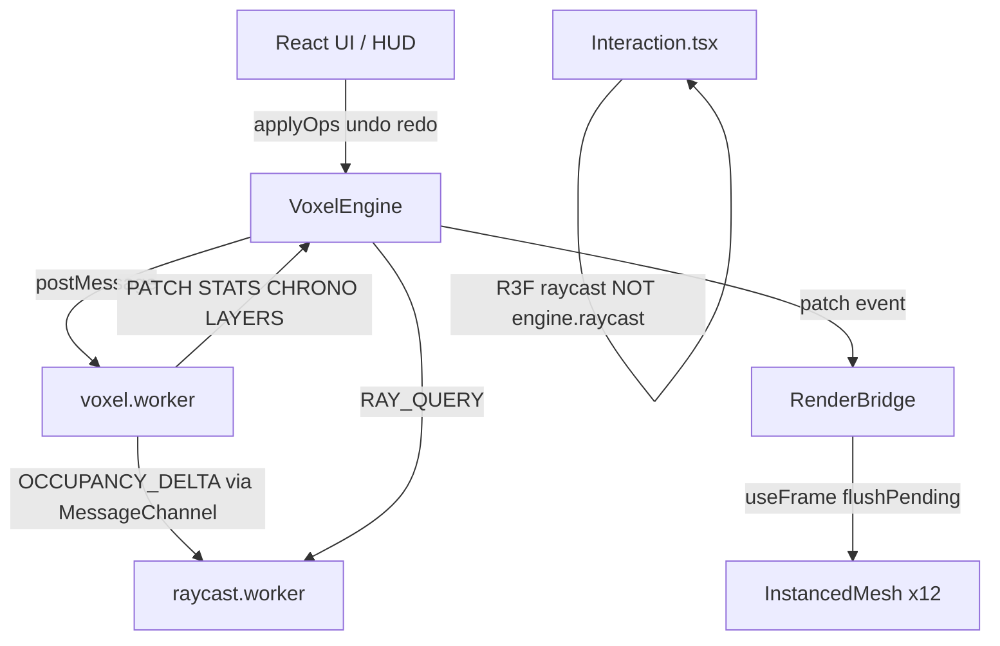

# Obsidian Protocol — Project Plan

**Saved:** 2026-05-20  
**Purpose:** Review snapshot of project status, documentation gaps, and recommended path forward.  
**Status when written:** V2 Phases 0–4 committed (`8f7e9e8`); Step 1 perf check still pending.

---

## What This Project Is

A browser-based 3D voxel editor set in a cyberpunk "Neural Architect" fantasy:

- 12 block types with GLSL shaders, brush tools, 12 layers, chrono-log undo/redo
- Corporate contracts, reactive post-FX, audio, quality presets, IndexedDB persistence
- Polished HUD (boot sequence, neon panels, shortcuts overlay)

The **V1 autopsy** (`docs/v1_autopsy.md`) identified the core problem: main-thread state thrashing caused 80–200ms hitches above ~800–1000 voxels, even when FPS looked fine.

**V2 mandate:** move voxel state off the main thread into a Web Worker, frame-coalesce GPU writes via `RenderBridge`, add chunking, and eventually binary persistence.

---

## Where Things Stand

### Git state (as of review)

| Item | Status |
|------|--------|
| Last committed milestone | Phase **3.5 + 4** (`8f7e9e8`), docs follow-up `0dedff3` |
| Branch | `master`, **7 commits ahead** of `origin/master` (nothing pushed) |
| Working tree | Clean except this file's edits — Phases 0–4 are all committed |

Confirmed committed (verified against the repo, not just the working tree):

- `stores/voxelStore.ts` **deleted** — only `uiStore` + `effectsStore` remain
- UI/scene components migrated to `engine.*` / `useEngine*` hooks
- `engine/worker/raycast.worker.ts` present and tracked
- `VoxelEngine.ts`, `voxel.worker.ts`, `WorkerProtocol.ts` carry the Phase 3.5/4 work

**No at-risk work.** The hard architecture rebuild is committed and safe. The only
unstarted V2 item is Phase 5 (`engine/persist/obs2.ts` and `compress.worker.ts`
do not exist yet).

### V2 phase tracker

| Phase | Description | Status |
|-------|-------------|--------|
| 0–2 | Engine scaffolding, worker, chunks, protocol | ✅ Committed |
| 3.1 | RenderBridge + worker re-INIT | ✅ Committed |
| 3.2 | Worker as mutation authority | ✅ Committed |
| 3.3 | `Voxels.tsx` → RenderBridge thin wrapper | ✅ Committed |
| 3.4 | All mutations → `IVoxelEngine` | ✅ Committed |
| 3.5 | Retire `voxelStore`; UI reads via engine hooks | ✅ Committed (`8f7e9e8`) |
| 4 | Raycast worker + `engine.raycast()` | ✅ Committed (`8f7e9e8`) — not wired to pointer input |
| 5 | OBS2 binary persistence + `compress.worker` | ❌ Not started |

### What's working well

**V2 architecture is in place:**

```
React UI → IVoxelEngine → voxel.worker (canonical state)
                ↓
         RenderBridge → 12 pre-allocated InstancedMeshes
                ↓
         useFrame flushPending() (frame-coalesced GPU writes)
```

Key wins:

- `Voxels.tsx` is a thin wrapper — no full-rebuild `useEffect`
- Incremental stats in the worker (O(1) integrity)
- 16³ chunks with bit-packed `uint16` cells
- Five reactive hooks replace `useVoxelStore` selectors
- `uiStore` + `effectsStore` unchanged (UI/effects only)

**V1 product polish is intact:** shaders, audio, contracts, layers, chrono-log, quality presets, 5 example vaults.

### Gaps and inconsistencies

1. **Raycast worker exists but isn't used for input** — `Interaction.tsx` still uses R3F/Three.js raycasting. `engine.raycast()` is API-ready for agents/gameplay, not pointer events.

2. **Persistence is still V1 JSON** — `lib/persistence.ts` and `engine.serialize()` use JSON + IndexedDB. Phase 5 (OBS2 + RLE + compress worker) is the next big engine item.

3. **No automated tests** — zero test files in the repo.

4. **Documentation out of sync** (re-verified 2026-05-20):

   | File | Problem |
   |------|---------|
   | `docs/README (1).md` | Stuck at Phase 3.1, May 10; also has the awkward ` (1)` filename |
   | `docs/technical-architecture.md` | Stale (dated 2026-05-13, baseline `2322016`); file map still lists `raycast.worker.ts` as "Future: Phase 4" though Phase 4 is done |
   | `docs/voxel-engine.md` | ✅ Accurate — correctly shows 3.5 ✅, 4 ✅, 5 ⏳. The most current doc; use it as the source of truth |
   | `docs/how-to-extend.md` | No longer references `voxelStore` (earlier claim was outdated); spot-check for other engine-migration gaps |
   | Root `README.md` | ✅ Fixed 2026-05-20 — `engine/` added, `voxelStore` removed from structure |

5. **README roadmap items not built:** Liveblocks, WebXR, WebGPU, glTF export, greedy meshing.

---

## Architecture Snapshot



**Engine contract:** `types/engine.ts` → `IVoxelEngine` (mutations, sync reads, `serialize()`, `raycast()`, events).

**Stores after 3.5:** `uiStore`, `effectsStore` only — no `voxelStore`.

---

## Recommended Path Forward

### Step 1 — Stabilize (do first)

**What “validate the perf fix” means (plain English):**  
V1 would *stutter or freeze* when you painted, undid, or loaded big builds (~800+ blocks) — even if the FPS counter still looked fine. V2 moved that work off the main thread. This check is: *does it feel smooth now on a big example?*

**How to do it (~2 min):**

1. Run `npm run dev` → open http://localhost:3000
2. Skip or click through the boot sequence
3. Bottom-left panel → click **BLACKSPIRE ARCOLOGY** (3,119 blocks)
4. Paint a large area (brush size up with `]`), erase, then **Ctrl+Z** undo a few times
5. **Feel test:** no noticeable freeze/hitch while doing the above
6. **Optional DevTools check:** F12 → Performance tab → Record while painting → stop. Look for red/long tasks on the main thread. V1 had 80–200ms spikes; V2 should stay mostly under ~16ms for interaction frames.

- [x] **Commit the working tree** — `8f7e9e8` *Phase 3.5 + 4: retire voxelStore, engine hooks, raycast worker*
- [x] **Validate build** — `npm run typecheck` and `npm run build` both pass (2026-05-20)
- [ ] **Perf check** — load Blackspire, stress paint/undo; confirm no V1-style hitches (see above)

If hitches remain, profile before new features. Likely culprits: brush expansion on main thread, `getAllCells()` on save, JSON serialize on large vaults.

### Step 2 — Finish V2 engine (Phase 5)

**OBS2 binary persistence** — highest-value remaining engine work:

- ~140× smaller saves (per internal docs)
- Faster load/save for large structures
- `compress.worker.ts` + wire `engine.loadSave()` / `serialize()` to binary
- **JSON ↔ OBS2 migration** for existing saves and `public/examples/`

### Step 3 — Optional Phase 4 follow-up

Only if profiling shows R3F raycasting as a bottleneck:

- Route pointer picking through `engine.raycast()`, or
- Keep R3F for UX; use worker raycast for AI/agents later

Don't prioritize unless perf data supports it.

### Step 4 — Documentation sync

| File | Action |
|------|--------|
| Rename `docs/README (1).md` → `docs/README.md` | Wiki index with current phase table |
| `docs/technical-architecture.md` | Mark phases 3.5 + 4 done; update file map (no "Future" raycast.worker); Phase 5 next |
| `docs/how-to-extend.md` | Spot-check for engine-migration gaps (no longer references `voxelStore`) |
| ~~Root `README.md` — add `engine/`, remove `voxelStore`~~ | ✅ Done 2026-05-20 |
| Root `README.md` roadmap | Split "V2 engine" vs "product roadmap" |

Optional root **STATUS.md** one-liner for quick orientation.

### Step 5 — Product direction (after V2 validated)

| Goal | Next work |
|------|-----------|
| **Portfolio demo** | Cinematic onboarding, boot flow polish, Vercel deploy |
| **Creative tool** | glTF export, greedy meshing for 10k+ voxels |
| **Multiplayer showcase** | Liveblocks |
| **Immersive** | WebXR "Neural Link" |

Defer these until V2 perf is validated and Phase 5 lands.

### Step 6 — Engineering hygiene (when bandwidth allows)

- Smoke tests for worker protocol (INIT → APPLY_OPS → PATCH → UNDO)
- CI: `typecheck` + `build` on push
- Push unpushed commits to `origin/master`

---

## Summary

**Polished V1 product + mostly-complete V2 engine rebuild.** Hard architecture work (worker state, RenderBridge, chunks, engine hooks) is in the working tree. Remaining for V2:

1. Commit and validate perf (original P0)
2. Phase 5 binary persistence
3. Sync documentation

Then choose product lane: demo, export, collab, or XR.

---

## Quick reference

| Doc | Topic |
|-----|--------|
| `docs/v1_autopsy.md` | Why V2 exists |
| `docs/technical-architecture.md` | Stack + file map |
| `docs/voxel-engine.md` | Worker, chunks, RenderBridge |
| `docs/how-to-extend.md` | Adding blocks/UI (needs V2 update) |
| `README.md` | User-facing features + setup |

---

*Generated from codebase review. Update this file when phases land or priorities change.*
